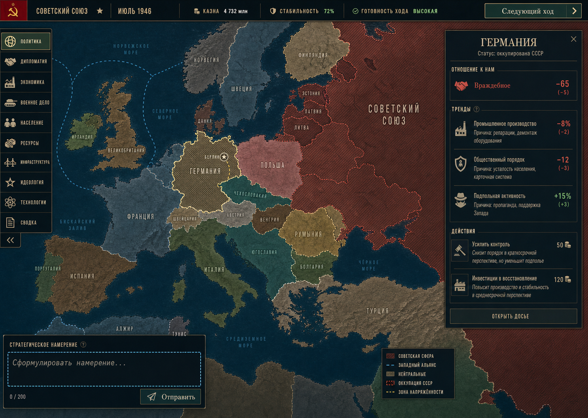
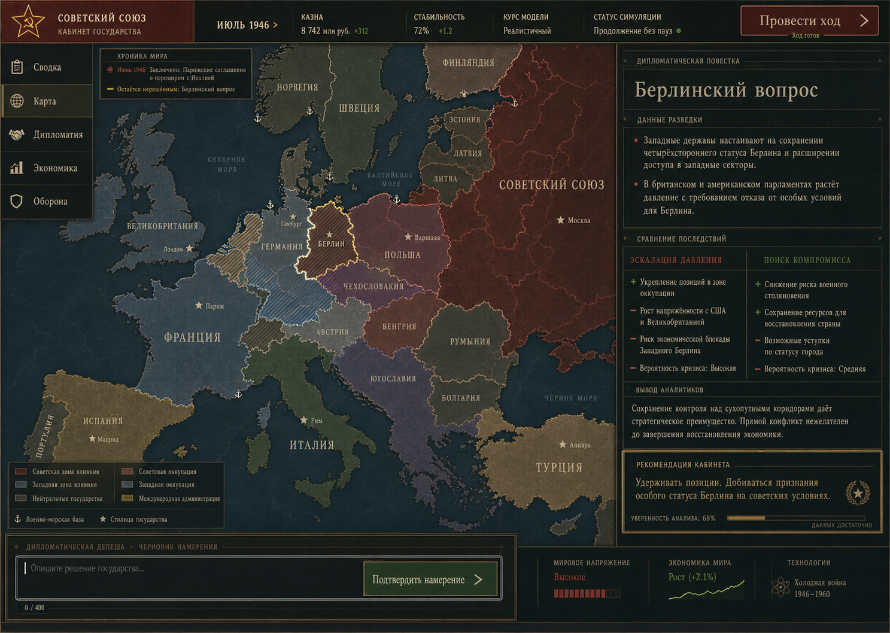
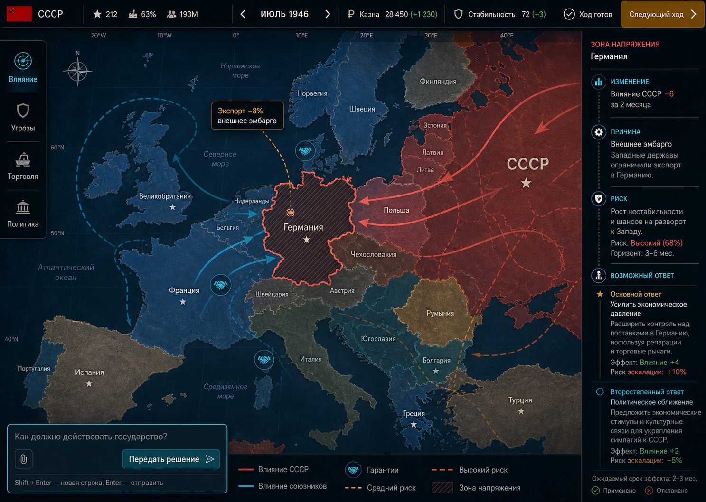

# Новый интерфейс Geopolis: три визуальных направления

Дата исследования: 2026-07-18  
**Статус: ИСТОРИЯ 2026-08-09 (домен `ui`). Не нормативен.**  
Рабочей ветки больше нет: `codex/interface-from-scratch` списана решением
пользователя 2026-08-09 и удалена вместе с деревом (471 коммит отставания, 105
файлов пересечения с веткой, которая старый слой уже удалила). Эта линия
канонической не выбрана.  
Архив исходной точки: `archive/interface-before-redesign` (`3c6cf29`)

Канонический интерфейс — `client/src/{game,ui,styles}`, описан в
`docs/UI_DESIGN.md`; прежние линии удалены, возврата к ним нет. Файл сохраняется
как discovery-исследование: ценность в разборе игровых циклов и в трёх
направлениях визуального языка, а не в адресах ветки.

## Статус и границы

Это discovery-артефакт перед реализацией, а не утверждённый макет. Текущий
интерфейс, его компоненты, стили и скриншоты намеренно не использовались как
референс. Концепты выведены из игровых циклов, серверных контрактов и
канонических документов по механикам.

Изображения сгенерированы как визуальные гипотезы. Текст, география и числа на
них могут содержать генеративные неточности; реализация должна брать данные и
локализацию только из игры.

## Что должен переживать игрок

Основной повторяемый цикл:

```text
изменение мира
→ понять контекст и причину
→ сравнить последствия
→ скорректировать бюджет или сформулировать свободное намерение
→ увидеть applied / rejected и причины
→ выбрать длину хода 1–12 месяцев
→ получить отчёт тика и новый мировой контекст
```

Первый кадр обязан за несколько секунд отвечать игроку на пять вопросов:

1. Кем я управляю и какая сейчас дата?
2. Что изменилось и требует ли это реакции?
3. Что сейчас выбрано на карте?
4. Какое решение я могу принять, с какой ценой и риском?
5. Почему ход доступен, заблокирован, ожидает LLM или был частично отклонён?

Подтверждённые ограничения:

- карта — главный интерфейс, а не фон dashboard;
- реальная дизайн-база — сценарий 1946: 1399 регионов и 157 стран;
- основная платформа — локальная browser/desktop-среда; mobile и gamepad не
  считаются подтверждёнными целями;
- ручной clipboard-flow LLM должен оставаться полноценным рядом с
  автоматическим провайдером;
- интерфейс обязан различать `pending`, `applied`, `partially applied`,
  `rejected` и серверную ошибку;
- пользовательские строки проходят через `react-i18next`, минимум RU/EN;
- цвет не может быть единственным носителем выбора, угрозы или оккупации;
- постоянный UI должен экономить площадь карты и не требовать обхода всего
  мира на hover или render.

## Направление A — «Картографический штаб»



### Взгляд игрока

«Я вижу мир первым, интерфейс — вторым. Выбираю страну или регион, сразу
понимаю отношение, три важных тренда и доступные действия. Слева меняю способ
чтения карты, снизу формулирую намерение, сверху вижу готовность хода».

### Композиция

- более 75% кадра занимает политическая карта;
- узкая верхняя полоса хранит идентичность страны, дату, казну, стабильность и
  состояние хода;
- левый рельс переключает map modes;
- справа открывается одно контекстное досье выбранного объекта;
- снизу слева находится компактный composer свободного намерения;
- оккупация, влияние и напряжение кодируются цветом вместе со штриховкой,
  контуром и линиями.

### Сильные стороны

- самый прямой и знакомый map-first ритм;
- хорошо сохраняет пространственную ориентацию;
- подходит для частого выбора стран, регионов и фронтов;
- контекстное досье легко закрыть, не теряя карту;
- историческая идентичность достигается картографией, а не декором.

### Риски

- длинный список map modes может превратиться в постоянное меню всех систем;
- узкая правая панель плохо подходит для сравнения бюджета, мира или двух
  стран;
- мелкая condensed-типографика на 1366×768 потребует отдельной проверки;
- composer конкурирует с картой в левом нижнем углу;
- концепт ошибочно показывает некоторые действия и статусы как уже доступные:
  реализация обязана сверяться с фактическими командами.

### Что проверять в прототипе

- карта остаётся рабочей при закрытом и открытом досье;
- досье не шире необходимого и не скрывает выбранную территорию;
- режимы карты сокращаются до подтверждённых задач, редкие уходят в on-demand;
- composer сохраняет текст при полном LLM-сбое;
- частичный успех показывает отдельно применённые и отклонённые действия.

## Направление B — «Кабинет государства»



### Взгляд игрока

«Я не просто кликаю по карте: я принимаю решение как руководитель
государства. Сначала читаю короткую повестку и доказательства, сравниваю два
курса, затем формулирую собственное решение и провожу ход».

### Композиция

- карта остаётся непрерывной основой и занимает около 70% кадра;
- верхний briefing band показывает состояние государства и симуляции;
- слева только пять входов: сводка, карта, дипломатия, экономика, оборона;
- справа — единый министерский бриф, а не сетка карточек;
- нижний diplomatic-cable composer подчёркивает свободную формулировку
  намерения;
- хронологическая дорожка связывает прошлый ход с текущим выбором.

### Сильные стороны

- лучше всех объясняет, зачем игрок принимает решение;
- естественно поддерживает evidence → trade-off → recommendation;
- хорошо подходит новичку и длинным паузам между сессиями;
- отчёт хода и хроника органично входят в одну информационную модель;
- обладает собственной исторической идентичностью без буквального
  skeuomorphism.

### Риски

- правая повестка занимает слишком много карты и может стать постоянной;
- рекомендация кабинета не должна подменять стратегический выбор игрока;
- «два готовых ответа» опасны для свободного intent: это подсказки, не
  ограниченный choice-event;
- serif и тёплая палитра требуют строгой проверки читаемости мелкого текста;
- нижняя полоса в концепте перегружена вторичными мировыми показателями.

### Что проверять в прототипе

- брифинг сворачивается до маркера события после прочтения;
- источники и причинность отделены от LLM-рекомендации;
- игрок может написать третий курс, не выбирая предложенные варианты;
- при возвращении из глубокого workspace сохраняются карта, selection и
  scroll;
- на 1366×768 остаётся видимой основная кнопка хода и минимум 65% карты.

## Направление C — «Контуры влияния»



### Взгляд игрока

«Я вижу не только значение, но и цепочку: что изменилось, почему, какой риск
возник и какой ответ возможен. Связи нарисованы поверх мира, поэтому мне не
нужно держать в памяти несколько таблиц».

### Композиция

- карта занимает более 78% viewport;
- верхняя строка предельно компактна;
- слева доступны четыре смысловых режима: влияние, угрозы, торговля,
  политика;
- справа causal inspector идёт сверху вниз:
  `изменение → причина → риск → возможный ответ`;
- связи влияния, гарантий, эмбарго и угроз показываются map-native контурами;
- composer находится в нижнем левом углу, легенда — внизу карты.

### Сильные стороны

- лучше всего раскрывает причинность и последствия;
- делает дипломатию и торговое давление пространственно понятными;
- явнее других различает риск, ожидаемый эффект и факт применения;
- современная читаемость сочетается с картографической идентичностью;
- структура инспектора масштабируется на бюджет, войну и отчёт хода без
  смены основной ментальной модели.

### Риски

- дуги и контуры быстро превращаются в визуальный шум при 157 странах;
- нужен строгий LOD, агрегация и показ только релевантного подмножества;
- холодная signal-room эстетика может выглядеть слишком современной для 1836;
- cyan/coral-семантика требует паттернов, формы и доступной альтернативы;
- предложенные системой «ответы» должны быть объяснимыми и не выглядеть
  гарантированным прогнозом LLM.

### Что проверять в прототипе

- одновременно видны только связи текущего selection и одной выбранной темы;
- легенда объясняет цвет, линию и паттерн, а не полагается только на оттенок;
- при zoom-out связи агрегируются, а не создают тысячи DOM/map объектов;
- причина отделяется от корреляции и от прогнозной рекомендации;
- rejected command сохраняет контекст и предлагает безопасный следующий шаг.

## Сравнение направлений

| Критерий | Картографический штаб | Кабинет государства | Контуры влияния |
|---|---|---|---|
| Map-first | высокий | средне-высокий | высокий |
| Порог входа новичка | средний | низкий | средний |
| Стратегическое сравнение | среднее | высокое | высокое |
| Причинность | средняя | высокая в брифе | высокая на карте |
| Скорость повторных действий | высокая | средняя | высокая |
| Риск перегрузки | меню и досье | длинный бриф | линии и overlays |
| Историческая гибкость 1836–2100 | высокая | средняя | средне-высокая |
| Основной implementation risk | responsive panel | content hierarchy | map LOD/performance |

## Предварительная рекомендация

Независимая UI-рецензия рекомендует **«Контуры влияния» как визуальную и
композиционную базу**. Это направление быстрее остальных связывает карту с
главным циклом игрока:

```text
выбрать проблему → понять изменение, причину и риск
→ выбрать курс → сформировать намерение → провести ход
```

Финальная архитектура не должна быть механической смесью всех трёх кадров:

1. взять map-first геометрию, короткий список режимов и causal inspector из
   «Контуров влияния»;
2. связать предложенный ответ с composer: выбор ответа формирует черновик
   намерения, а не создаёт параллельную систему команд;
3. взять текстовые labels и on-demand country dossier из
   «Картографического штаба»;
4. взять структуру `evidence → trade-off → decision` из «Кабинета государства»
   для focused workspaces и отчёта хода;
5. показывать causal overlay только для текущего selection и map mode;
6. оставить один постоянный composer намерения и одну явную кнопку хода;
7. глубокие бюджетные, военные и дипломатические сравнения открывать как
   focused workspace, а не держать постоянными панелями.

Главный P1-риск всех трёх вариантов — недоказанная компоновка на 1366×768.
Сгенерированные файлы имеют размер 1487×1058, несмотря на целевую композицию
1440×1024. На 1366×768 без page scroll должны оставаться видимыми selection,
причина, риск, основной ответ, composer и кнопка хода; вторичное объяснение
уходит в disclosure или внутренний scroll.

Выбор визуальной базы остаётся за пользователем. До выбора направления нельзя
начинать реализацию: выбранное изображение станет visual target, после чего
нужны implementation-ready UX contract, ExecPlan и адаптивный интерактивный
прототип.

## Общие критерии следующего этапа

- desktop wide и narrow, минимум отдельная проверка 1440×1024 и 1366×768;
- RU/EN, длинные строки, locale-aware числа и даты;
- pointer и полный keyboard/focus path для core loop;
- состояния no selection, loading, empty, stale, unavailable, insufficient,
  pending, partially applied, rejected, success и server error;
- ручной no-API LLM flow и автоматический provider flow;
- сохранение intent и selection после ошибок;
- autosave и отчёт хода только после реально успешного advance;
- отсутствие полного обхода мира при hover/render;
- визуальное значение продублировано цветом, формой, линией, паттерном или
  текстом;
- карта остаётся главным рабочим пространством, а не декоративным фоном.

## Prompt set

Все изображения созданы built-in Image Gen как независимые `ui-mockup`
варианты с целевой композицией desktop 1440×1024; фактический размер файлов —
1487×1058. Общие обязательные условия: Geopolis,
июль 1946, СССР, fullscreen map-first, русский UI, естественно-языковое
намерение, явный turn lifecycle, один hero decision, отсутствие dashboard
grid, glassmorphism, browser chrome и заимствований из текущего интерфейса.

- «Картографический штаб»: Cold War cartographic operations room, правое
  country dossier, левый map-mode rail, compact intent composer.
- «Кабинет государства»: mid-century governmental editorial system,
  ministerial brief, consequence comparison, diplomatic-cable composer.
- «Контуры влияния»: modern geopolitical signal room, causal inspector,
  selective influence/trade/threat contours and explicit applied/rejected
  semantics.
